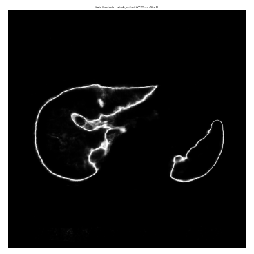
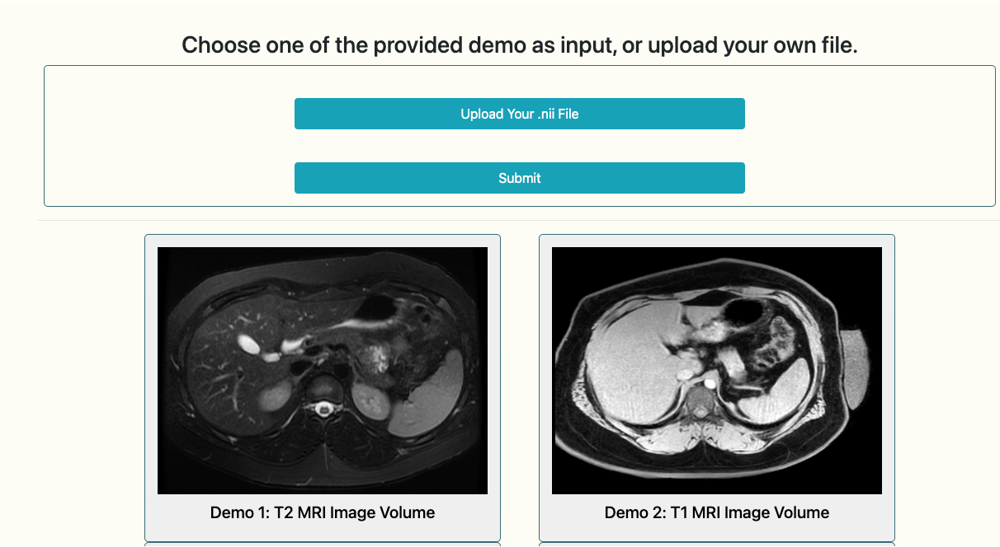
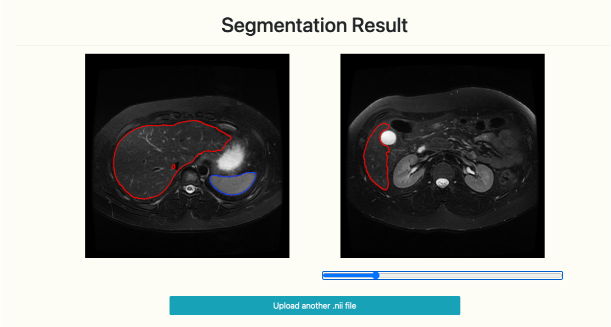

# Abdominal-MRI-Segmentation
To develop an AI system for precise and fully automatic simultaneous segmentation of liver and spleen on routine clinical pediatric and adult
MRI T2-weighted, T1-weighted and DWI data curated from multiple institutions.

# Installation
1. Clone the repository: `git clone https://github.com/HuixianZhang/Abdominal-MRI-Segmentation.git`
2. Navigate to the project directory: `cd Abdominal-MRI-Segmentation`
3. Install dependencies.

# Model Uncertainty

run "Draw_uncertainty_map.py", you will get images like below:

# Demo
We launched our model on our internal website, it looks like:

Stay tuned for more updates!

